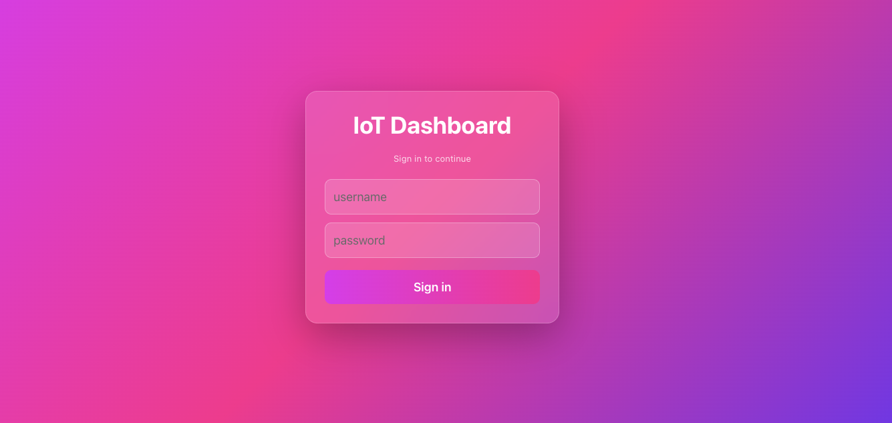
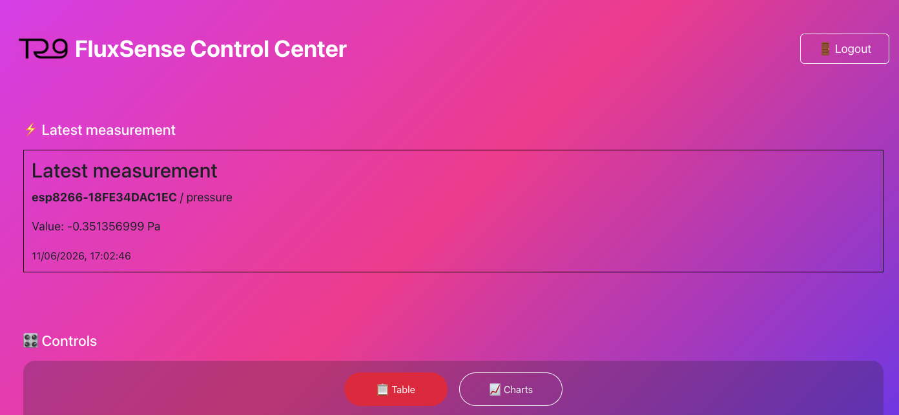
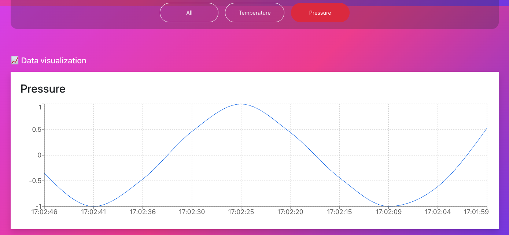

 # FluxSense – IoT Data Platform

 ## 1. Project Overview

 FluxSense is a distributed IoT system designed for collecting, processing, storing, and visualizing sensor data originating from embedded ESP8266 devices.

 The platform simulates a real-world telemetry pipeline used in industrial monitoring systems. It integrates embedded firmware, message-oriented middleware, backend services, and a modern web interface into a unified data processing ecosystem.

 The entire system is fully containerized using Docker Compose, which allows the user to start all components with a single command.

 ---

 ## 2. System Architecture

 The system is based on a layered architecture with clear separation of responsibilities:

 ESP8266 devices publish sensor data using MQTT protocol over a secure TLS connection. Messages are received by the Mosquitto broker and forwarded to an asynchronous ingestion service. The ingestor processes incoming telemetry data and stores it in a PostgreSQL database. The stored data is then exposed via a Django REST API and consumed by a React-based frontend application.

 This results in the following data flow:

 ESP8266 → MQTT Broker → Ingestor → PostgreSQL → Django API → React UI

 ---

 ## 3. System Components

 ### Embedded Layer (ESP8266)

 ESP8266 devices simulate real-world sensors by generating temperature and pressure measurements. Each device publishes data periodically to MQTT topics using a structured naming convention.

 ---

 ### Messaging Layer (MQTT Broker)

 The system uses Eclipse Mosquitto as a message broker. It handles all incoming MQTT traffic and ensures reliable message delivery using QoS 1. Communication is secured using TLS certificates.

 ---

 ### Ingestion Layer

 The ingestion service is implemented in Python using asynchronous programming (asyncio). It subscribes to MQTT topics, parses incoming JSON payloads, validates data, and persists it into the database.

 ---

 ### Database Layer (PostgreSQL)

 All sensor data is stored in a PostgreSQL relational database. The schema is optimized for time-series queries and supports efficient filtering by device, sensor type, and timestamp.

 ---

 ### Backend Layer (Django REST API)

 The backend exposes a REST API that provides access to stored measurements. It supports filtering, retrieval of the latest values, and historical data queries. Authentication is handled using JWT tokens.

 ---

 ### Frontend Layer (React UI)

 The frontend application provides an interactive dashboard for visualizing sensor data. Users can switch between tabular and chart-based views, filter data by sensor type, and monitor the latest measurements in real time.

 ---

 ## 4. How to Run the System

 ### 4.1 Prerequisites

 Before starting the system, ensure that the following software is installed:

 - Docker Desktop
 - Docker Compose v2 or higher
 - Modern web browser (Chrome, Firefox, Edge recommended)

 ---

 ### 4.2 Starting the System

 To start the entire platform, navigate to the project root directory (where `docker-compose.yml` is located) and execute:

 ```
 docker compose up --build
 ```

 This command will automatically build and start all required services, including the MQTT broker, ingestion service, database, and Django backend.

 ---

 ### 4.3 Accessing the Application

 After successful startup, the user interface is available in the browser at:

 ```
 http://localhost:5173/
 ```

 The backend API is available at:

 ```
 http://localhost:5001/api/
 ```

 ---

 ## 5. User Workflow

 After launching the system, the user interacts with the application through the following steps:

 First, the user opens the frontend application in a web browser. 
 


 The system presents a login screen requiring valid credentials. After submitting the login form, the backend issues a JWT access token and refresh token, which are stored in the browser’s local storage.

 Once authenticated, the user is redirected to the main dashboard. The dashboard provides access to live and historical sensor data. The interface allows switching between table and chart views, as well as filtering data based on sensor type (temperature, pressure, or all sensors).



 The “Latest Measurement” panel displays the most recent value received from the system, providing near real-time insight into sensor activity.



 ---

 ## 6. Authentication

 The system uses JWT-based authentication implemented via Django REST Framework SimpleJWT.

 Authentication endpoints:

 - POST /api/token/
 - POST /api/token/refresh/

 All protected endpoints require the following HTTP header:

 ```
 Authorization: Bearer <access_token>
 ```

 Unauthorized requests return HTTP 401 status code.

 ---

 ## 7. Data Model

 Sensor data is stored in a relational structure optimized for time-based queries.

 Each measurement contains:

 - device identifier
 - sensor type
 - measured value
 - unit of measurement
 - timestamp (epoch milliseconds)
 - MQTT topic metadata

 ---

 ## 8. System Summary

 FluxSense demonstrates a complete IoT data pipeline including embedded devices, message broker communication, asynchronous processing, persistent storage, and interactive data visualization.

 The architecture is designed to be modular, scalable, and easily extendable with additional sensors or services.


 ---

 ## 10. Conclusion

 FluxSense integrates multiple modern technologies into a cohesive distributed system, demonstrating principles of IoT communication, event-driven architecture, and full-stack application design.

 The system can be easily extended with additional analytics modules, real-time streaming features, or cloud deployment strategies.
